# Лабораторная работа 2. Отчет 

Всё время указано в мс.

## Задача 1

При реализации каждой версии алгоритма матрица сохранялась в виде одномерного массива rows * cols. При этом вектор, на который производилось умножение, инициализировался размером в cols элементов. Предполагалось, что количесто элементов матрицы кратно количеству процессов-участников выполнения.

### Умножение с разбиением по строкам

В данной реализации при помощи функции MPI_Scatter матрица matrix равномерно распределялась между процессами-участниками выполнения. Исходный вектор vector полностью транслировался в каждый из процессов. Каждый процесс получал для вычисления rows / comm_sz строк, и выдавал rows * cols / comm_sz элементов искомого вектора - результата умножения.

Графики его производительности:

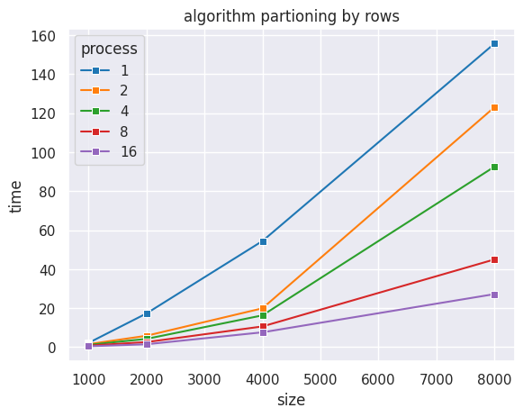

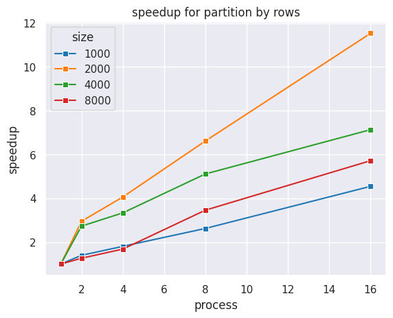

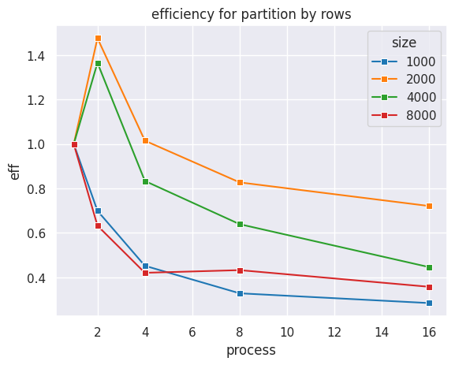

Можно видеть, что ускорение равномерно возрастает.

### Умножение с разбиением по столбцам

В этой реализации матрица matrix целиком транслировалась между всеми процессами. Для каждого процесса считались столбцы, на которых необходимо произвести операции, по формуле: local_cols = cols / comm_sz; start_col = my_rank * local_cols; end_col = start_col + local_cols (отдельно считались столбцы для процесса с номером comm_sz - 1). Перед операцией MPI_Reduce для суммирония результата на локальных элементах результирующего вектора устанавливался барьер MPI_Barrier.

Графики его производительности:

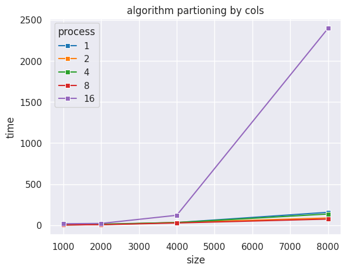

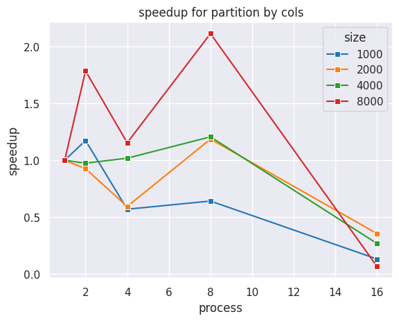

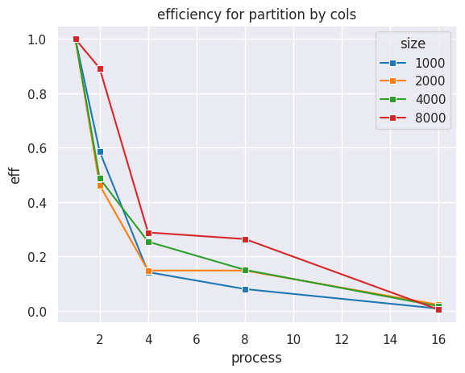

### Умножение с разбиением по блокам

В этой реализации матрица matrix также целиком транслировалась между всеми процессами. Матрица будет делиться квадратной сеткой N на N блоков, тогда в каждой ячейке будет строк rows / N и количество столбцов cols / N. Далее блоки умножаются на соответствующую часть вектора по строкам. 
Так как сетка квадратная, то количество задействованных процессов в умножении матрицы на вектор будет равняться корню ближайшего снизу квадрата (1, 4, 9, 16, ...). 
То есть процессов 5, то мы создадим сетку на 2*2 блоков. 

Графики его производительности:

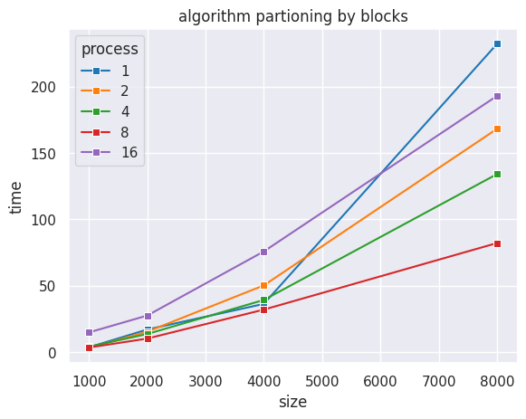

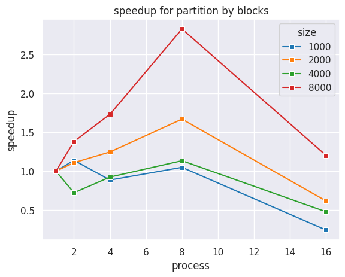

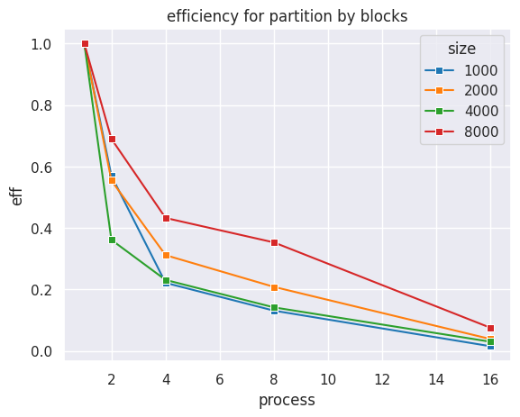

## Задача 2

Алгоритм реализован в соответствии с его описанием, приведенным в учебнике Гергеля, приложенному к материалам для лабораторной работы.

На матрицу накладиывались следующие ограничения:
- Матрица обязательно квадратная
- Число процессов $p$ есть полный квадрат $k ^ 2 = p$
- Сторона матрицы $n$ кратно $k$

Этот алгоритм подразумевает разделение исходных матриц на блоки (декартову решётку), равные по размеру. Блоки на соответствующих координатах перемножаются и записываются в результат, после чего на левой матрице при помощи MPI_Cart_shift производился циклический сдвиг влево, а на правой - циклический сдвиг вверх. Это производилось $\sqrt{comm\_sz}$ раз.

Графики производительности реализации алгоритма:

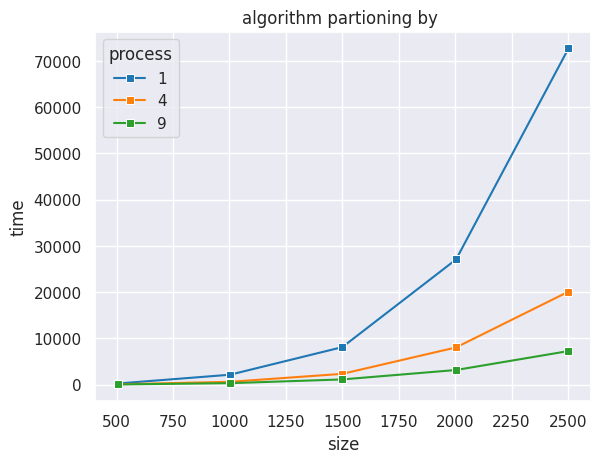

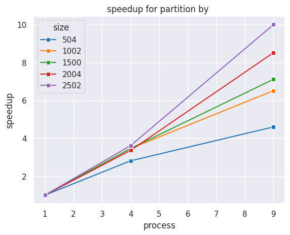

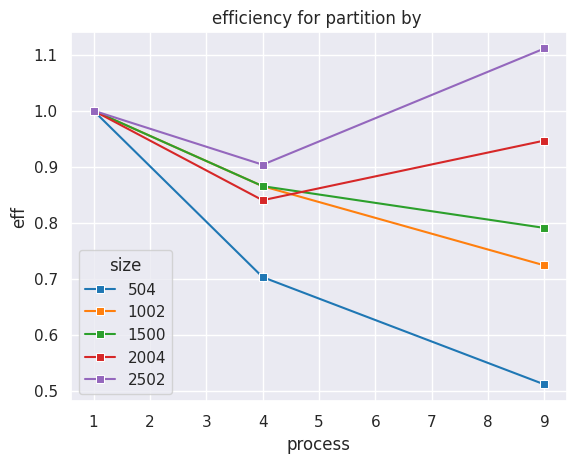